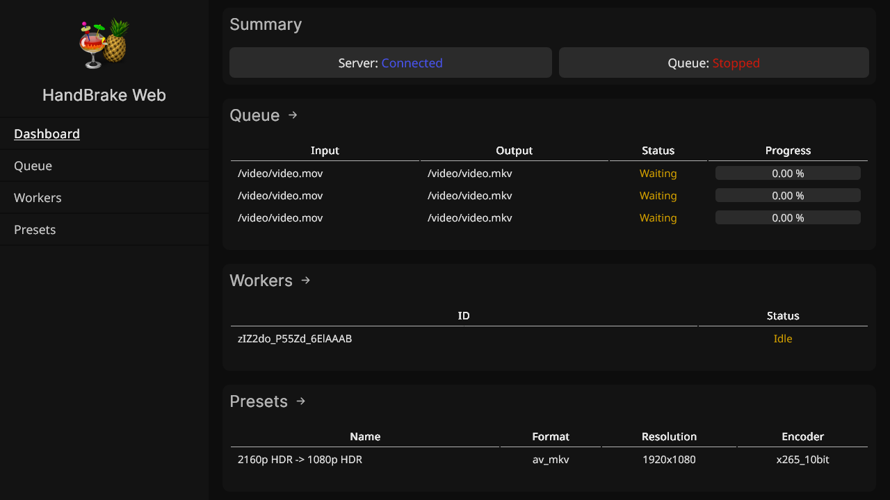
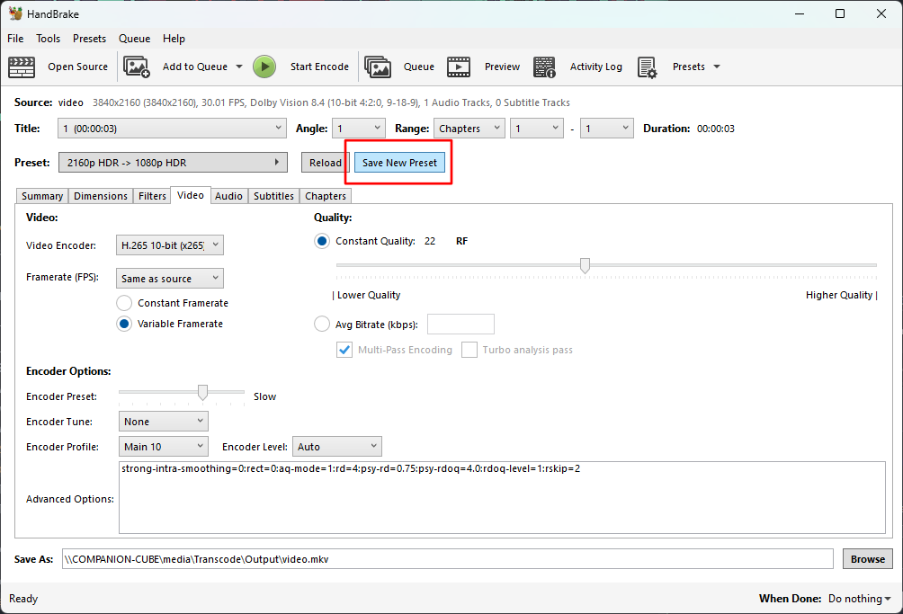
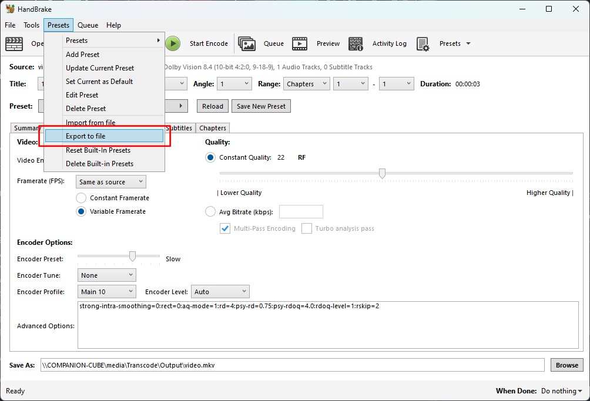
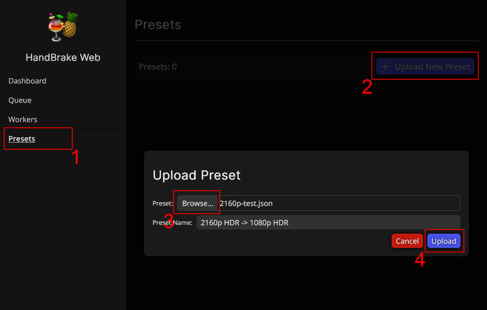

# HandBrake Web

<p align='center'>
    
</p>

HandBrake Web is a program for interfacing with handbrake across multiple machines via a web browser. It consists of two components: the **server** and one or more **worker**(s). **_Warning_** - This application is still under heavy development, use at your own risk, to learn more please see the [Known Issues & Limitations](#planned-features-not-yet-implemented) section.

### Server

The server component primarily acts as a coordinator for the workers. Additionally it serves the client interface. **The work done by the server is not computationally expensive** - it can be run on low-end/low-power devices with no issue.

### Worker(s)

The worker component does the heavy lifting via HandBrakeCLI. Jobs are sent to workers by the server, and the workers will process the provided media based on a provided HandBrake preset configuration. **The work done by the worker is very computationally expensive** - it is recommended that you **run a single worker instance per machine**, and that machine either have a high core-count CPU _or_ have GPU hardware transcoding features available to the worker.

## Setup

HandBrake Web is deployed via docker, and most easily via `docker compose`. The below setup will guide you to have the server and a single worker instance running on the same machine.

### Docker Compose

1. Copy the example docker compose

   ```yaml
   services:
     handbrake-server:
       image: ghcr.io/thenickoftime/handbrake-web:latest
       container_name: handbrake-web-server
       environment:
         - HANDBRAKE_MODE=server
       ports:
         - 9999:9999# HandBrake Web
   ```

<p align='center'>
    
</p>

HandBrake Web is a program for interfacing with handbrake across multiple machines via a web browser. It consists of two components: the **server** and one or more **worker**(s). **_Warning_** - This application is still under heavy development, use at your own risk, to learn more please see the [Known Issues & Limitations](#planned-features-not-yet-implemented) section.

### Server

The server component primarily acts as a coordinator for the workers. Additionally it serves the client interface. **The work done by the server is not computationally expensive** - it can be run on low-end/low-power devices with no issue.

### Worker(s)

The worker component does the heavy lifting via HandBrakeCLI. Jobs are sent to workers by the server, and the workers will process the provided media based on a provided HandBrake preset configuration. **The work done by the worker is very computationally expensive** - it is recommended that you **run a single worker instance per machine**, and that machine either have a high core-count CPU _or_ have GPU hardware transcoding features available to the worker.

## Setup

HandBrake Web is deployed via docker, and most easily via `docker compose`. The below setup will guide you to have the server and a single worker instance running on the same machine.

### Docker Compose

1. Copy the example docker compose

```yaml
services:
  handbrake-server:
    image: ghcr.io/thenickoftime/handbrake-web:latest
    container_name: handbrake-web-server
    environment:
      - HANDBRAKE_MODE=server
    ports:
      - 9999:9999
    volumes:
      - /path/to/your/data:/data
      - /path/to/your/media:/video #ensure this path is the same across all containers

  handbrake-worker:
    image: ghcr.io/thenickoftime/handbrake-web:latest
    container_name: handbrake-web-worker
    environment:
      - HANDBRAKE_MODE=worker
      - WORKER_ID= #give your worker a unique name
      - SERVER_URL= #set to the url or ip of your server
      - SERVER_PORT= #if using a reverse proxy, this may be different than what is set above
    volumes:
      - /path/to/your/media:/video #ensure this path is the same across all containers
    depends_on:
      - handbrake-server
```

2. Configure the following:
   - **Server Port Mapping**: 9999 by default (change the lefthand side of `9999:9999` if you have a conflict)
   - **Volume Mappings**: Importantly, the same media path must be mapped to `/video` across the server and _all_ worker instances.
   - **Worker Environment Variables**: Tell your worker where to connect to the server via the `SERVER_URL` and `SERVER_PORT` environment variables. Ensure the port is set to the external mapping you set earlier.
3. Run `docker compose up`.
   - The client interface will be available at the address & port you configured.
   - The worker(s) will automatically connect to the server and wait for jobs.

#### Recommended Additional Steps

- Use a reverse proxy (traefik, nginx, etc) to access your interface at a custom url over https.

#### Additional Workers

To run additional workers, simply launch additional worker container instances on different machines by omitting the `handbrake-server` service from the example compose file. **Reminder** - It is recommended to run only one worker instance per machine, as a single worker will very likely push most CPUs to 100% utilization during transcoding.

Because of this, your server instance must be reachable outside of the machine it is running on. In most cases the port mapping should make this work, but if you are running an additional firewall, ets. please configure accordingly.

## Usage

### Presets

HandBrake Web currently uses presets configured in the desktop application of HandBrake and
exported to .json files to configure transcoding jobs. Exported presets can then be uploaded via the web interface in the 'Presets' section.

| Configure & Save Preset                          | Export Preset To File                              | Upload Preset File to HandBrake Web                |
| ------------------------------------------------ | -------------------------------------------------- | -------------------------------------------------- |
|  |  |  |

## Features

### Current Features

- Distributed Transcoding - leverage multiple devices to tackle transcoding as workers
- Web Interface - Interact with HandBrake Web via your web browser
- Transcode Queue - queue up multiple transcode jobs for your workers to tackle in order
- Add Jobs Via Directory - bulk add videos to transcode
- Preset Manager - Upload, Rename, and Delete HandBrake presets in the web interface

### Planned Features (not yet implemented)

- Directory Monitoring - for automatic job creation
- Preset Creator - create presets directly in the web interface
- User Sessions - logging in required to access the web interface

## Known Issues & Current Limitations

### Current Limitations

Please see the planned features section, as all of these are intended to be addressed.

- Jobs can only be created manually via the web interface
- Presets have to be created externally and uploaded to HandBrake Web
- No security features on the client interface

       volumes:
         - /path/to/your/data:/data
         - /path/to/your/media:/video

  handbrake-worker:
  image: ghcr.io/thenickoftime/handbrake-web:latest
  container_name: handbrake-web-worker
  environment: - HANDBRAKE_MODE=worker - WORKER_ID= #give your worker a unique name - SERVER_URL= #set to the url or ip of your server - SERVER_PORT= #if using a reverse proxy, this may be different than what is set above
  volumes: - /path/to/your/media:/video
  depends_on: - handbrake-server

  ```

  ```

2. Configure the following:
   - **Server Port Mapping**: 9999 by default (change the lefthand side of `9999:9999` if you have a conflict)
   - **Volume Mappings**: Importantly, the same media path must be mapped to `/video` across the server and _all_ worker instances.
   - **Worker Environment Variables**: Tell your worker where to connect to the server via the `SERVER_URL` and `SERVER_PORT` environment variables. Ensure the port is set to the external mapping you set earlier.
3. Run `docker compose up`.
   - The client interface will be available at the address & port you configured.
   - The worker(s) will automatically connect to the server and wait for jobs.

#### Recommended Additional Steps

- Use a reverse proxy (traefik, nginx, etc) to access your interface at a custom url over https.

#### Additional Workers

To run additional workers, simply launch additional worker container instances on different machines by omitting the `handbrake-server` service from the example compose file. **Reminder** - It is recommended to run only one worker instance per machine, as a single worker will very likely push most CPUs to 100% utilization during transcoding.

Because of this, your server instance must be reachable outside of the machine it is running on. In most cases the port mapping should make this work, but if you are running an additional firewall, ets. please configure accordingly.

## Usage

### Presets

HandBrake Web currently uses presets configured in the desktop application of HandBrake and
exported to .json files to configure transcoding jobs. Exported presets can then be uploaded via the web interface in the 'Presets' section.

| Configure & Save Preset                          | Export Preset To File                              | Upload Preset File to HandBrake Web                |
| ------------------------------------------------ | -------------------------------------------------- | -------------------------------------------------- |
|  |  |  |

## Features

### Current Features

- Distributed Transcoding - leverage multiple devices to tackle transcoding as workers
- Web Interface - Interact with HandBrake Web via your web browser
- Transcode Queue - queue up multiple transcode jobs for your workers to tackle in order
- Add Jobs Via Directory - bulk add videos to transcode
- Preset Manager - Upload, Rename, and Delete HandBrake presets in the web interface

### Planned Features (not yet implemented)

- Directory Monitoring - for automatic job creation
- Preset Creator - create presets directly in the web interface
- User Sessions - logging in required to access the web interface

## Known Issues & Current Limitations

### Current Limitations

Please see the planned features section, as all of these are intended to be addressed.

- Jobs can only be created manually via the web interface
- Presets have to be created externally and uploaded to HandBrake Web
- No security features on the client interface
