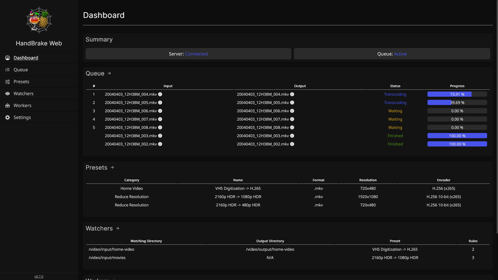
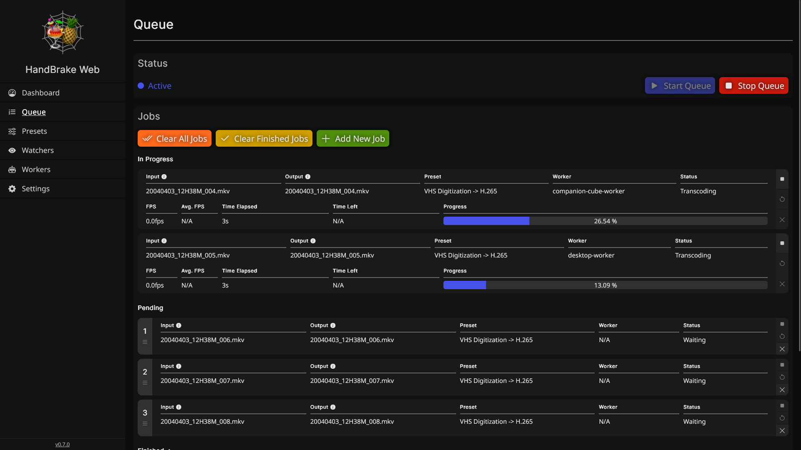
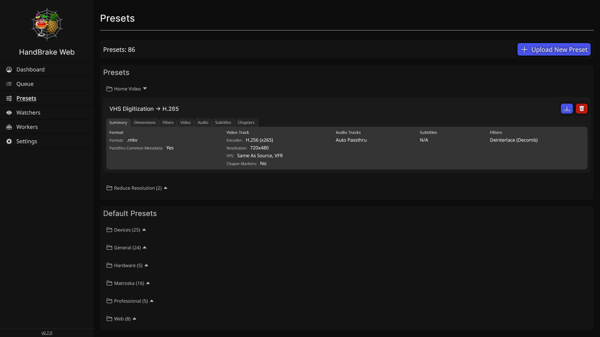

> [!NOTE]
> Development may be slow for the month of September since I will be travelling. v0.8.0 planning is underway and development will occur whenever possible :relaxed:

<div align='center'>
    <h1 style='{text-decoration: none}'>HandBrake Web</h1>
    <div align='center'>
      <a href='https://github.com/TheNickOfTime/handbrake-web/blob/main/LICENSE'>
        
      </a>
      <a href='https://github.com/TheNickOfTime/handbrake-web/releases/latest'>
        
      </a>
      <a href='https://github.com/TheNickOfTime/handbrake-web/milestone/5'>
        
      </a>
      <a href='https://github.com/TheNickOfTime/handbrake-web/milestone/5'>
        
      </a>
      <a href='https://github.com/TheNickOfTime/handbrake-web/actions/workflows/docker-publish.yaml?query=branch%3Amain'>
        
      </a>
      <a href='https://buymeacoffee.com/thenickoftime'>
        
      </a>
    </div>
    <div align='center'>
      <strong>Disclaimer:</strong>
      <em>This project is not related to or part of the official <a href='https://github.com/HandBrake/HandBrake'>HandBrake</a> development. It simply uses the CLI component of HandBrake under the hood.</em>
    </div>
    
</div>

<div align='center' width=100%>
  <details>
    <summary>Screenshots (click to expand)</summary>
    
    
    
    
    
    
  </details>
</div>

## Summary

HandBrake Web is a program for interfacing with handbrake across multiple machines via a web browser. It consists of two components: the **server** and one or more **worker**(s). **_Warning_** - This application is still under heavy development, use at your own risk, to learn more please see the [Known Issues & Limitations](#planned-features-not-yet-implemented) section.

### Server

The server component primarily acts as a coordinator for the workers. Additionally it serves the client interface. **The work done by the server is not computationally expensive** - it can be run on low-end/low-power devices with no issue.

### Worker(s)

The worker component does the heavy lifting via HandBrakeCLI. Jobs are sent to workers by the server, and the workers will process the provided media based on a provided HandBrake preset configuration. **The work done by the worker is very computationally expensive** - it is recommended that you **run a single worker instance per machine**, and that machine either have a high core-count CPU _or_ have GPU hardware transcoding features available to the worker.

## Setup

HandBrake Web is deployed via docker, and most easily via `docker compose`. The below setup will guide you to have the server and a single worker instance running on the same machine.

### Docker Compose

1. Copy the example docker compose

```yaml
services:
  handbrake-server:
    image: ghcr.io/thenickoftime/handbrake-web-server:latest
    container_name: handbrake-web-server
    user: 1000:1000 # edit to run as user (uuid:guid) with permissions to access your media. 0:0 to run as root (not recommended).
    ports:
      - 9999:9999
    volumes:
      - /path/to/your/data:/data
      - /path/to/your/media:/video # ensure this path is the same across all containers

  handbrake-worker:
    image: ghcr.io/thenickoftime/handbrake-web-worker:latest
    container_name: handbrake-web-worker
    user: 1000:1000 # edit to run as user (uuid:guid) with permissions to access your media. 0:0 to run as root (not recommended).
    environment:
      - WORKER_ID=handbrake-worker # give your worker a unique name
      - SERVER_URL=handbrake-server # change if setting up a standalone worker, prefix with http(s):// if necessary
      - SERVER_PORT=9999 # change if using a reverse proxy or the port is otherwise different than above
    volumes:
      - /path/to/your/media:/video # ensure this path is the same across all containers
    depends_on:
      - handbrake-server
```

2. Configure the following:
   - **Server Port Mapping**: 9999 by default (change the lefthand side of `9999:9999` if you have a conflict)
   - **User Mapping**: 1000:1000 by default (change to run as a user that will have adequate permissions to access the media directories that you map). 0:0 or removing this line will run the container as root - this is generally not recommended but will almost guarantee no permission issues.
   - **Volume Mappings**: Importantly, the same media path must be mapped to `/video` across the server and _all_ worker instances.
   - **Worker Environment Variables**: Tell your worker where to connect to the server via the `SERVER_URL` and `SERVER_PORT` environment variables. Ensure the port is set to the external mapping you set earlier.
3. Run `docker compose up`.
   - The client interface will be available at the address & port you configured.
   - The worker(s) will automatically connect to the server and wait for jobs.

#### Recommended Additional Steps

- Use a reverse proxy (traefik, nginx, etc) to access your interface at a custom url over https.

#### Hardware Transcoding Support (experimental)

> [!Warning]
> Hardware Transcoding will generally result in larger files with worse quality at the same settings as CPU Transcoding, with the advantage of transcoding (sometimes significantly) faster. If your goals are to produce the highest quality transcodes at the smallest file sizes, stick to CPU transcoding.

Currently NVENC and QSV hardware transcoding are supported, though the extent to which they work is experimental sdince my testing occurred on a very limited set of hardware available to me. Both of these require additional configuration. Please see the comments on [this issue](https://github.com/TheNickOfTime/handbrake-web/issues/88) for setup instructions while official documentation is being made.

#### Additional Workers

To run additional workers, simply launch additional worker container instances on different machines by omitting the `handbrake-server` service from the example compose file. **Reminder** - It is recommended to run only one worker instance per machine, as a single worker will very likely push most CPUs to 100% utilization during transcoding.

Because of this, your server instance must be reachable outside of the machine it is running on. In most cases the port mapping should make this work, but if you are running an additional firewall, ets. please configure accordingly.

## Usage

### Presets

HandBrake Web currently uses presets configured in the desktop application of HandBrake and
exported to .json files to configure transcoding jobs. Exported presets can then be uploaded via the web interface in the 'Presets' section.

<table>
	<thead>
		<tr>
			<th width=33% align='center'>Configure & Save Preset</th>
			<th width=33% align='center'>Export Preset To File</th>
			<th width=33% align='center'>Upload Preset to HandBrake Web</th>
		</tr>
	</thead>
	<tbody>
		<tr>
			<td></td>
			<td></td>
			<td></td>
		</tr>
	</tbody>
</table>

## Features

### Current Features

- Distributed Transcoding - leverage multiple devices to tackle transcoding as workers
- Web Interface - Interact with HandBrake Web via your web browser
- Transcode Queue - queue up multiple transcode jobs for your workers to tackle in order
- Add Jobs Via Directory - bulk add videos to transcode
- Preset Manager - Upload, Rename, and Delete HandBrake presets in the web interface
- Directory Monitoring - for automatic job creation

### Planned Features (not yet implemented)

- Preset Creator - create presets directly in the web interface
- User Sessions - logging in required to access the web interface

## Known Issues & Current Limitations

### Current Limitations

Please see the planned features section, as all of these are intended to be addressed.

- Presets have to be created externally and uploaded to HandBrake Web
- No security features on the client interface
